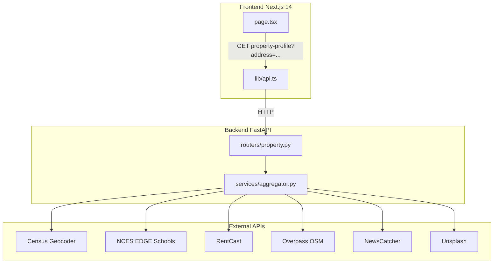
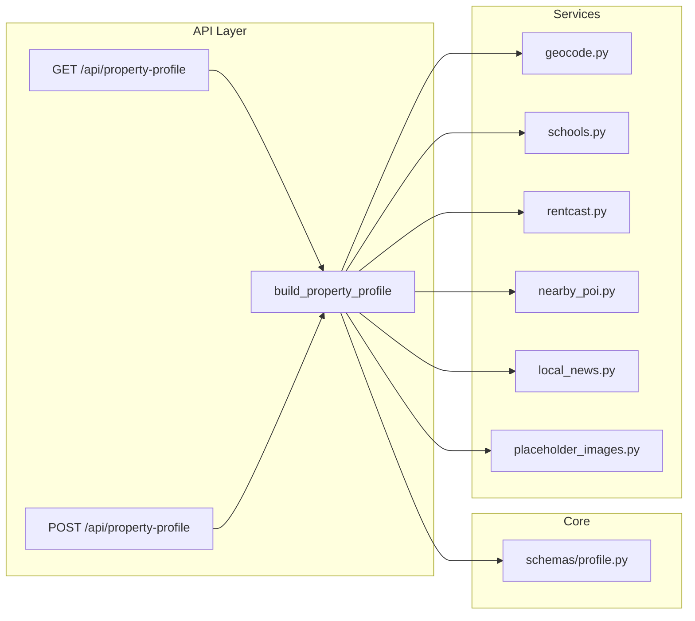
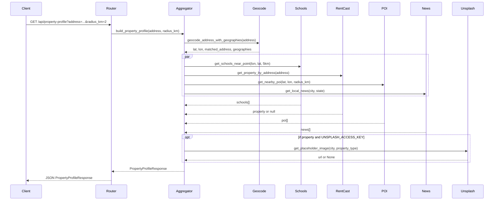

# Real Estate App – Design Diagram

This document describes the frontend (Next.js) and backend (FastAPI) architecture, data flow, and external integrations. Mermaid diagrams render in GitHub, GitLab, and most Markdown viewers.

**Rendered PNGs** (generated from [diagrams/](diagrams/) with `@mermaid-js/mermaid-cli`): [1-overview](diagrams/1-overview.png) · [2-backend](diagrams/2-backend.png) · [3-sequence](diagrams/3-sequence.png) · [4-frontend](diagrams/4-frontend.png)

---

## 1. High-level system overview



- **Frontend**: Single-page app ([frontend/app/page.tsx](../frontend/app/page.tsx)); calls backend via [frontend/lib/api.ts](../frontend/lib/api.ts) (`fetchPropertyProfile(address, radiusKm?)`).
- **Backend**: [app/main.py](../app/main.py) mounts [app/routers/property.py](../app/routers/property.py); main entry for profiles is `GET/POST /api/property-profile`, implemented by [app/services/aggregator.py](../app/services/aggregator.py).

---

## 2. Backend architecture



- **Config**: [app/config.py](../app/config.py) loads `.env` (no extra lib); exposes `RENTCAST_API_KEY`, `NEWSCATCHER_API_KEY`, `UNSPLASH_ACCESS_KEY`.
- **Aggregator flow**: Geocode first (Census) → then `asyncio.gather( schools, property, poi, news )` → if property exists and Unsplash key set, fetch one placeholder image → build [app/schemas/profile.py](../app/schemas/profile.py) `PropertyProfileResponse`.
- **Services** (all under [app/services/](../app/services/)):
  - **geocode.py**: Census Geocoder `geographies/onelineaddress` → lat, lon, matched_address, geographies.
  - **schools.py**: NCES EDGE (no key) → schools near (lon, lat, 5 km).
  - **rentcast.py**: RentCast by address (key required) → property or null.
  - **nearby_poi.py**: Overpass API (no key) → POI by (lat, lon, radius_km); timeout 45s + retry on 502/503/504.
  - **local_news.py**: NewsCatcher Local News API then main v3 API fallback (key) → list of news items.
  - **placeholder_images.py**: Unsplash (key) → one image URL when property exists.

---

## 3. Backend data flow (sequence)



---

## 4. Frontend architecture

```mermaid
flowchart TB
  subgraph page [Page State]
    ViewState[viewState: empty | loading | error | result]
    Profile[profile: PropertyProfileResponse | null]
    Loading[loading]
    Error[error]
  end
  subgraph layouts [Layouts]
    Empty[Centered search]
    LoadingLayout[Header + ResultSkeleton]
    ResultLayout[Header + ResultView]
    ErrorLayout[Centered ErrorState + search]
  end
  ViewState --> Empty
  ViewState --> LoadingLayout
  ViewState --> ResultLayout
  ViewState --> ErrorLayout
  ResultLayout --> ResultView
  ResultView --> MapView
  ResultView --> ResultRightPanel
  ResultRightPanel --> Tabs[Tabs: Property, Location, Schools, Places, News]
  ResultRightPanel --> PropertyCard
  ResultRightPanel --> LocationCard
  ResultRightPanel --> SchoolsList
  ResultRightPanel --> PlacesList
  ResultRightPanel --> NewsList
  ResultRightPanel --> DetailPanel
```

- **Page** ([frontend/app/page.tsx](../frontend/app/page.tsx)): Holds `profile`, `loading`, `error`; derives `viewState`; renders one of four layouts; **AddressSearch** (default or compact) triggers `fetchPropertyProfile` and sets profile/loading/error.
- **Result view** ([frontend/components/ResultView.tsx](../frontend/components/ResultView.tsx)): 50/50 split — left: **MapView** (Leaflet, center + schools + POI, optional `focusPoint` for flyTo); right: **ResultRightPanel** (tabs + list/detail). State: `activeTab`, `selectedDetail`, `mapFocus`; selecting a school/place sets `mapFocus` and optional detail.
- **ResultRightPanel** ([frontend/components/ResultRightPanel.tsx](../frontend/components/ResultRightPanel.tsx)): Tabbed content (Property, Location, Schools, Nearby places, News). Property/Location = single card; Schools/Places/News = clickable lists; **DetailPanel** for selected item with Back and optional "Show on map".
- **MapView** ([frontend/components/MapView.tsx](../frontend/components/MapView.tsx)): Lazy-loads **MapViewInner** (Leaflet); accepts `focusPoint` for flyTo; mounts map after `useEffect` to avoid React Strict Mode double-init.

---

## 5. Response shape (key types)

- **PropertyProfileResponse** (backend [app/schemas/profile.py](../app/schemas/profile.py), frontend [frontend/lib/types.ts](../frontend/lib/types.ts)): `location`, `map` (center + schools), `schools`, `property`, `property_message`, `listings`, `images`, `nearby_places`, `radius_km`, `local_news`.
